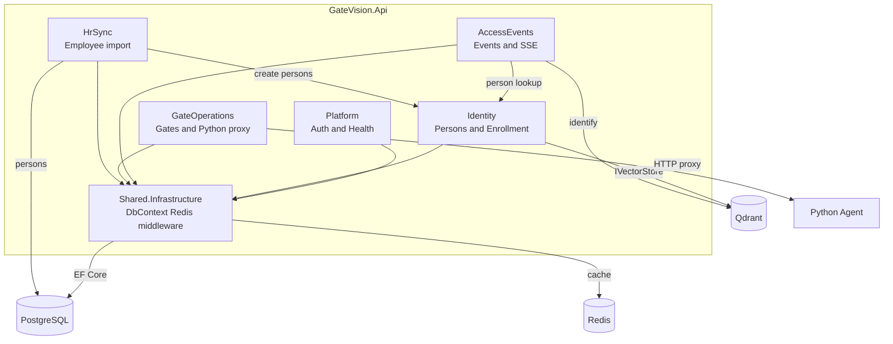

# C4 Level 3 — Components (GateVision.Api)

> C4-style component view using standard Mermaid `flowchart`.



## Feature module layout

```
Features/
  Identity/       Person aggregate, enrollment, face storage
  AccessEvents/   GateEvent, TrainingEvent, ValidatedEvent, identify pipeline
  GateOperations/ Gate entity, Python gateway, kiosk config
  HrSync/         MySQL employee import
  Platform/       Auth token, health
Shared/
  Kernel/         Result, PagedResult, shared enums
  Infrastructure/ AppDbContext, AuthMiddleware, hosted services
```

## Dependency rule

`Api → Application → Domain`; Infrastructure implements ports; Domain never references Api.
