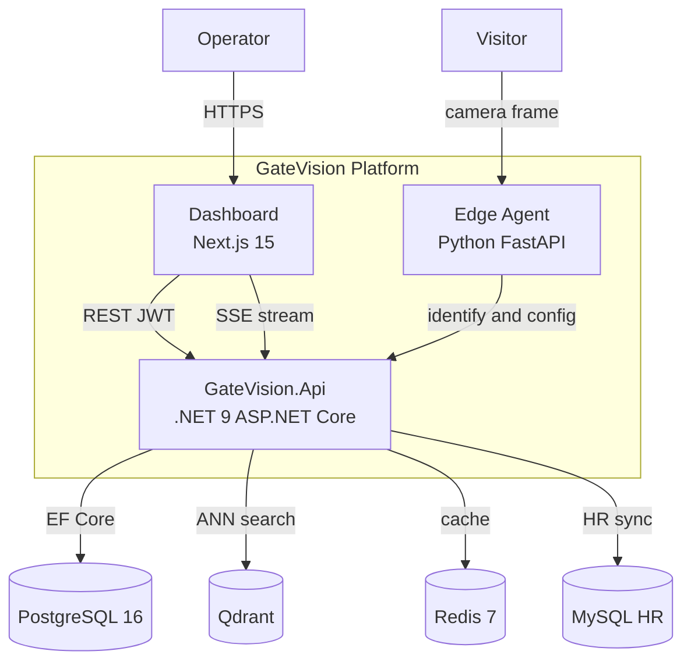

# C4 Level 2 — Containers

> C4-style container view using standard Mermaid `flowchart`.

## Deployment notes

- **Docker Compose** runs Postgres (`:6667`), Redis, Qdrant, MySQL test only
- **Host processes**: `GateVision.Api` (`:5000`), `dashboard` (`:3000`), edge agents (`:8000+`)

See [deployment.mmd](deployment.mmd) for full topology.
