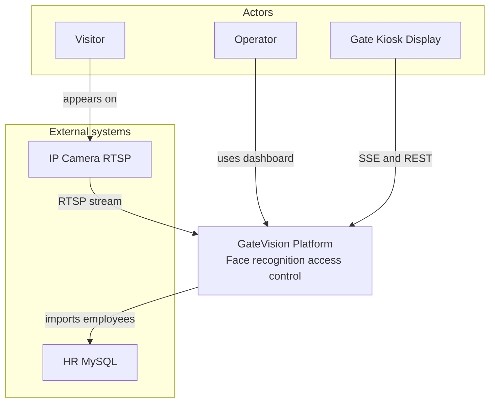

# C4 Level 1 — System Context

> C4-style context view using standard Mermaid `flowchart` (portable across GitHub, Cursor, and most renderers).

## Actors

| Actor | Interaction |
|-------|-------------|
| Operator | Next.js dashboard — person CRUD, event review, gate admin |
| Visitor | Detected by Python edge agent at physical gate |
| Gate kiosk | Browser on desk machine — live event stream |

## External systems

| System | Role |
|--------|------|
| IP Camera / RTSP | Video source for face detection |
| HR MySQL | Source of employee records (`employees` table) |
| PostgreSQL | Events, persons, gates (via Docker) |
| Qdrant | 512-dim ArcFace embeddings |
| Redis | Person metadata cache |
