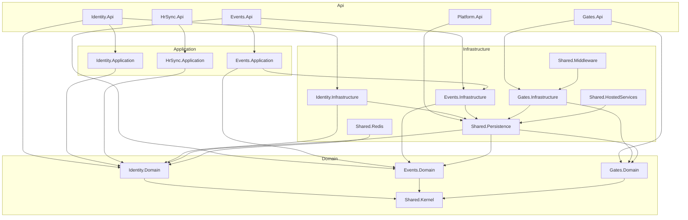
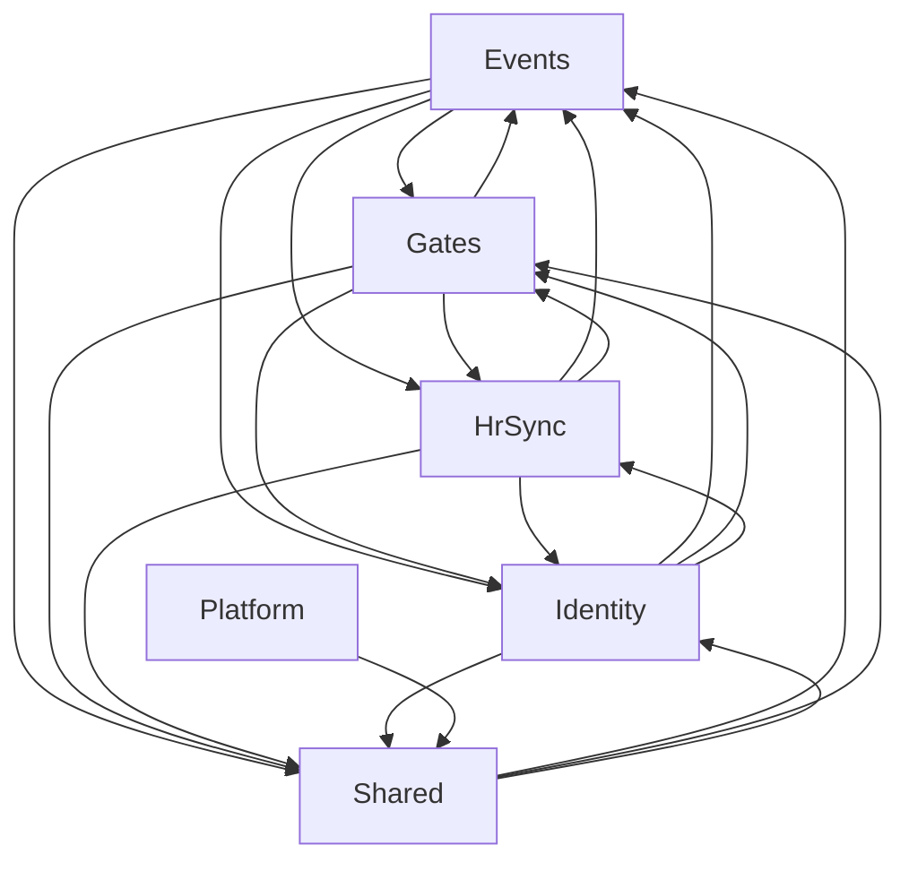

# GateVision.Api Dependency Report

- **Files analyzed:** 35
- **Namespaces:** 20
- **Dependency edges:** 114

## Circular dependencies
- None detected (excluding same-namespace usings)

## Architecture layers (readable)

Aggregated from namespace `using` analysis. Full detail: `dependency-report.json`.

## Observed cross-feature dependencies

Feature-to-feature edges only (Api/Application/Infrastructure collapsed per bounded context).

## Full namespace graph

Too large to render inline. Open [`dependency-graph-aggregated.mmd`](dependency-graph-aggregated.mmd) or `dependency-report.json`.
