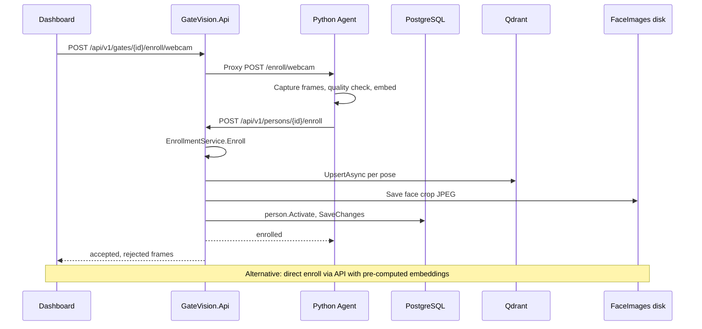

# Sequence: Face Enrollment

## Enrollment paths

| Path | Entry point |
|------|-------------|
| Webcam via gate | Dashboard → API proxy → Python → callback enroll |
| Profile bulk | `bulk-enroll-profiles` reads disk profile image |
| HR import | `HrSync` fetches photo from MySQL uploads path |
