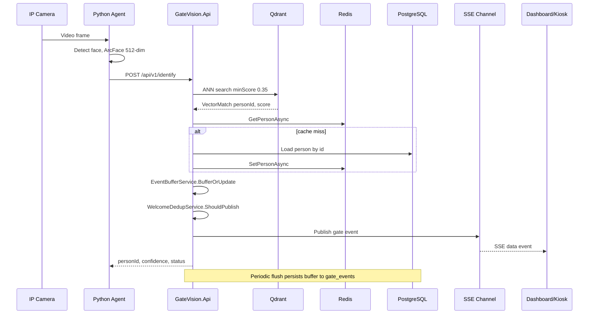

# Sequence: Face Identification

## Key decisions

- **Track buffering**: Same `track_id` merges frames; only best-confidence frame triggers SSE
- **Training mode**: Unknown faces stored as `training_events` when enabled
- **Auto-validation**: Confidence > 0.85 creates `validated_events` on flush
